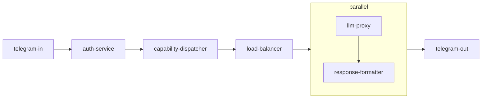

# Service Pipe Architecture (exp-013)

## Experiment Details

| Item | Value |
| --- | --- |
| Experiment | exp-013 |
| Status | Proposed |
| Author | Divan Visagie |
| Date | 03/06/2025 |

## Abstract

This project explores composing independent services using simple Unix-style pipes. Each service communicates via a lightweight JSON Lines (JSONL) protocol. By tagging every message with a `type` and optional `correlationId`, these services can be rearranged without changing code. The experiment demonstrates this approach by building a Telegram bot pipeline.

## Motivation

Modern systems often require complex network setups to connect small services. Using Unix pipes and a single streaming format simplifies this. With one protocol and small utilities, we can chain tools together much like classic shell commands.

## Hypothesis

If each service accepts and emits JSONL streams, pipelines become easy to reconfigure. We expect a modular and language‑agnostic system that handles batch or continuous data equally well.

## Methodology

The experiment chains services together with `|` while ensuring each command reads and writes JSONL. Observations and logs live under `logs/` with ISO date names.

### Primary Demonstration Pipeline

```bash
telegram-in \
| auth-service \
| capability-dispatcher --capabilities 'canned-responder;llm-responder' \
| load-balancer --workers 4 \
| parallel --jobs 4 --pipe --line-buffer 'llm-proxy | response-formatter' \
| telegram-out
```



#### telegram-in
Receives messages from Kafka and converts them to the experiment format.

#### auth-service
Checks user permissions and enriches messages.

#### capability-dispatcher
Routes requests to canned or LLM responders.

#### load-balancer
Assigns a `workerId` so parallel workers know which messages to handle.

#### parallel block
Runs `llm-proxy` and `response-formatter` concurrently.

#### telegram-out
Publishes final responses back to Kafka.

### Environment Variables for Telegram Adapters

| Variable | Purpose | Default |
| --- | --- | --- |
| `KAFKA_BROKERS` | Comma separated broker list | – |
| `KAFKA_IN_TOPIC` | Topic consumed by `telegram-in` | `telegram_in` |
| `KAFKA_OUT_TOPIC` | Topic produced by `telegram-out` | `telegram_out` |

## Pipe Protocol

Every JSONL message follows a small set of fields.

### JSON Lines
Each line is a complete JSON object. The newline separates messages.

### Message Fields

| Field | Purpose | Required |
| --- | --- | --- |
| `type` | Identifies the message so services know if they should act | Yes |
| `correlationId` | Traces a request through the pipeline | Recommended |
| `workerId` | Marks which worker should handle the message | Optional |

### Processing and Forwarding
Services check `type` (and `workerId` when set). They modify or pass through messages, always preserving the JSONL format.

### Additional Utilities
Utilities like `jsonl-wrap` or `load-balancer` help integrate regular commands and balance work across parallel processes.

## Success Criteria

- The Telegram pipeline runs end to end.
- `type` and `correlationId` allow tracing and routing.
- `parallel` improves throughput for LLM calls.
- `jsonl-wrap` successfully wraps arbitrary commands.
- The order of services can change without redeployment.
- Long-running pipelines support both batch and streaming modes.

## Challenges

- Keeping strict JSONL formatting across every service.
- Managing backpressure when parts of the pipeline run slower.
- Overhead from launching many short-lived processes.
- Building a robust `load-balancer` that handles failures gracefully.
- Debugging output from multiple concurrent workers.

## Expected Outcome

This approach should enable highly composable and modular architectures that leverage existing Unix tools. We expect insights into efficient scaling patterns for both batch and continuous workloads.

## Next Steps

- Finalize utilities like `jsonl-wrap` and `load-balancer`.
- Define a standard JSONL command protocol.
- Create schemas for common message `type` values.
- Build additional monitoring and debugging helpers.
- Explore dynamic service discovery and more flexible orchestration.

## References

- [Unix Philosophy and IPC via pipes](https://en.wikipedia.org/wiki/Unix_philosophy)
- [JSON Lines Specification](https://jsonlines.org/)
- [GNU Parallel documentation](https://www.gnu.org/software/parallel/)
- [Microservices Architecture patterns](https://microservices.io/)
- [Event-Driven Architecture](https://martinfowler.com/articles/201701-event-driven.html)
- [Unix Pipes and Filters pattern](https://www.enterpriseintegrationpatterns.com/patterns/messaging/PipesAndFilters.html)

